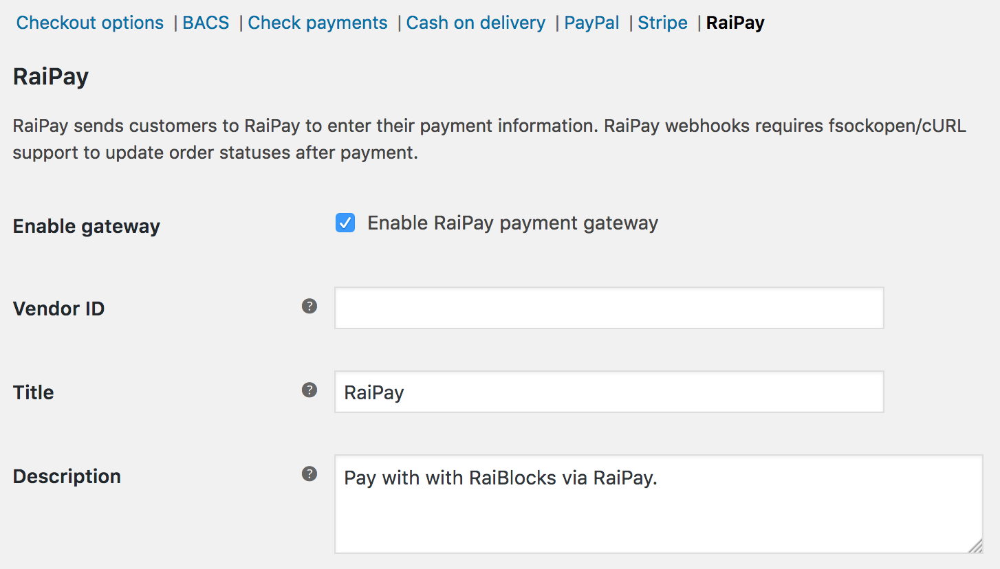
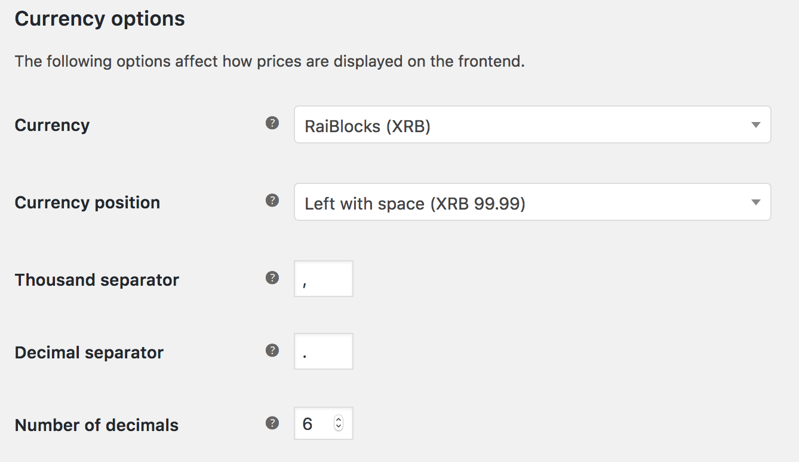

# RaiPay for WooCommerce
WooCommerce payment gateway plugin that allows your customers to pay with RaiBlocks via [RaiPay](https://raipay.io/).

**Important note:** Remember RaiPay and this plugin are still in beta and things may not go smoothly. Always test on a non-production environment before you attempt to run this on a production website.

## Install
Until this plugin is available on WordPress.org, you can grab a ready to install zip from the [releases](https://github.com/coenjacobs/raipay-woocommerce/releases). Upload this zip in your WordPress administration panel and activate it.

## Configuration
After activating the plugin, there are a couple minor configuration steps required in order to start accepting payments via RaiPay.

### RaiPay settings
After registering at RaiPay for an account, you will need to provide your vendor ID to the plugin. You can find the settings pictured below via WordPress administration panel > WooCommerce > Settings > Checkout (tab) > RaiPay (link):

### Currency
You can select RaiBlocks (XRB) as the currency of your store after activating this plugin. You can find these settings via WordPress administration panel > WooCommerce > Settings > General (tab) > Currency options. Prices need to be specified in 6 decimals in order to work with most wallet configurations (as they don't support more decimals when sending XRB):

Alternatively, RaiPay can dynamically convert USD prices into XRB prices. You can leave your prices in USD and RaiPay will do the converting for you. RaiPay currently does not support any other currencies than XRB and USD.

## License
GPLv2 or later